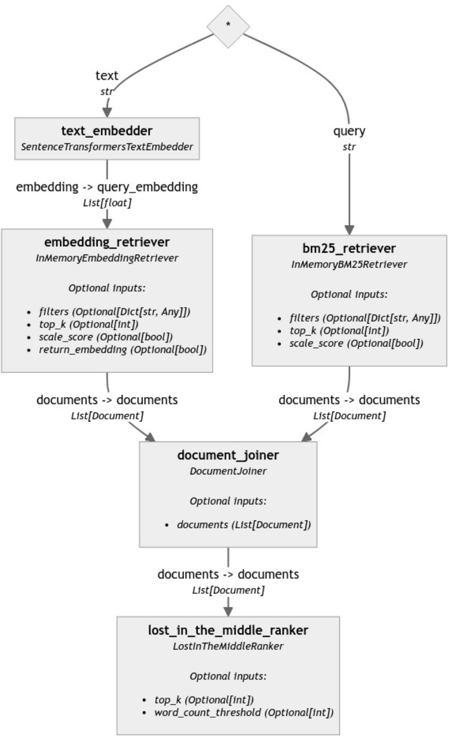

# Кейс Банк России 🏛️

Система, способная отвечать на вопросы пользователей о Банке России на естественном языке. Она использует передовые методы машинного обучения и обработки естественного языка для поиска информации из официального сайта Банка России.

## Функциональные возможности ⭐
__Поиск информации__: 
Система находит ответы на широкий спектр вопросов о Банке России, включая его функции, структуру, продукты и услуги.

__Естественный язык__: Пользователи могут задавать вопросы простыми словами, так же, как они бы спросили человека.

__Высокое качество__: Наше решение достигает хороших значений метрик, что подтверждает высокое качество генерации ответов.

## Реализация 🔥

__Hybrid Document Retriever__: гибридный подход к поиску информации, сочетающий в себе нейросетевые подход, так и классические методы на основе частот встречаемости слов, таких как BM25.

__LostInTheMiddleRanker__: анализирует найденные документы и определяет их релевантность к запросу пользователя. Алгоритм учитывает частоту встречаемости ключевых слов, структуру документа. Использование реранкера документов перед подачей в LLM позволило LLM меньше забывать детали важного контекста.

__Векторная база данных__: ElasticsearchEmbeddingRetriever для хранения эмбеддингов документов, что обеспечивает быстрый и эффективный поиск информации с возможностью масштабирования. Наша база данных разворачивается через докер и не стирается при отключении бэкенд или фронтенд части.

__Метаданные__: Векторный поиск мы осуществляем не только по контексту, но и по метаданным, в частности, по заголовку документа. Это позволяет правильно отвечать там, где информация в контексте написана слишком расплывчато и не содержит нужной концентрации информации.

__Фильтрация__: Наше решение предусматривает поддержку быстрого внедрения фильтрации по метаданным, что при минимальной доработке решения позволит сортировать документы практически по любым метаданным, таким как дата, заголовок, версия документа и другие.

__Возможность дальнейших улучшений__: База знаний может дополняться новыми данными из официального сайта Банка России для повышения качества генерации ответов.

## Схемы пайплайнов:
  

## Преимущества 💥

1. Практическая ценность: Решение важной прикладной задачи для Банка России, которое позволяет ему эффективно обрабатывать запросы пользователей.
    
2. Простота использования: Рост в использовании и не требует от пользователей специальных знаний программирования.
    
3. Масштабируемость: Система может быть легко масштабирована для обработки больших объемов информации.
    
4. Потенциал для развития: Система имеет большой потенциал для развития, включая возможность добавления новых компонентов в архитектуре (энкодеры, ранкеры) и улучшения качества генерации ответов.

## Структура проекта

В этом проекте используется следующая структура директорий:

1. **data**: В этой директории хранятся данные, необходимые для векторного поиска. Включает в себя небольшие текстовые файлы, остальные ресурсы подгружаются отдельно.

2. **front**: Реализация GUI для наглядной демонстрации работы.

3. **ml-service**: Реализация backend части на FastAPI.

Папки с экспериментами:

4. **extract**: Здесь содержатся скрипты или модули, отвечающие за извлечение информации из документов Банка России. Это может включать в себя текстовые, структурные или семантические методы извлечения.

5. **parser**: Директория с кодом и скриптами, предназначенными для обработки входных данных с сайта cbr.ru.

6. **prepare_data_pdf**: предварительная обработка данных для документов в формате PDF.

7. **semantic_search**: Здесь располагаются компоненты, отвечающие за семантический поиск информации в документах Банка России.

8. **smart_search**: Если предусмотрен "умный" поиск, который получает топ релевантных документов для дальнейшей обработки большой языковой моделью.

## Скрины работы решения:
  

В нашу систему можно подгружать любые данные для поиска по ним:  

  

  

## Команда

- Одобеску Роман - teamlead
- Сим Роман - ml-engineer
- Загорулько Олег - nlp-engineer
- Хакимуллин Рустем - nlp-engineer
- Александр Гавриленко - ml-engineer
